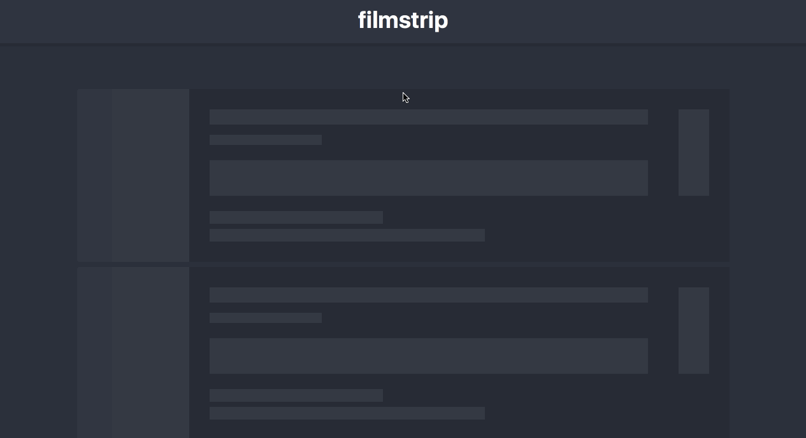

# Filmstrip Web

[](https://david-dm.org/yenbekbay/filmstrip-web)
[](https://david-dm.org/yenbekbay/filmstrip-web?type=dev)
[](http://commitizen.github.io/cz-cli)

The client-side app for Filmstrip. Built with [Next.js](https://github.com/zeit/next.js) ([React](https://github.com/facebook/react), [Webpack](https://github.com/webpack/webpack), [Glamor](https://github.com/threepointone/glamor)), [Redux](https://github.com/reactjs/redux), and [Apollo Client](https://github.com/apollostack/apollo-client).



## Running the app

0. **This repository is only the frontend. Run the [Filmstrip API](https://github.com/yenbekbay/filmstrip-api) first.**

1. **Install node/npm/yarn.** The app has been tested with node `6.9.1`.

2. **Clone and install dependencies:**
```bash
$ git clone https://github.com/yenbekbay/filmstrip-web.git
$ cd filmstrip-web
$ yarn # npm install
```

3. **Run the app:**
```bash
$ yarn start # npm start
```


## License

[GNU GPLv3 License](./LICENSE) © Ayan Yenbekbay
